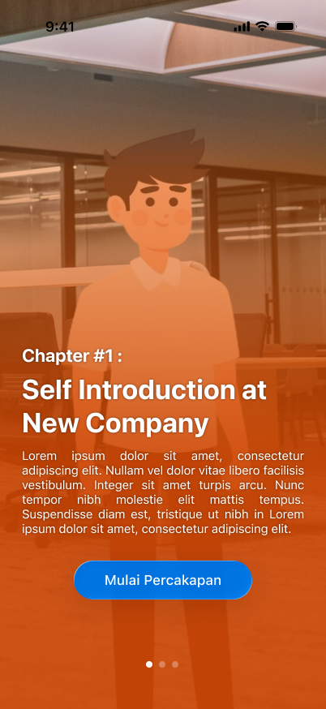

# SpeakHao 

**Master Mandarin Chinese through interactive, AI-powered conversation scenarios.**

SpeakHao is an iOS language learning app that combines real-time speech recognition, AI-powered NPC conversations, and interactive translation tools to help learners practice Mandarin Chinese in immersive dialogue scenarios.

## Overview

SpeakHao transforms language learning from rote memorization into dynamic, real-world conversation practice. Users engage with AI-controlled NPCs in contextual scenarios, receive instant feedback through speech recognition, and leverage on-device AI for realistic conversations. The app combines modern iOS frameworks with Apple Intelligence to create a seamless learning experience without requiring external API calls.

## Features

- **Interactive Conversation Scenarios** — Engage with AI-controlled NPCs in structured dialogue scenes (e.g., client meetings, restaurant orders, business negotiations)
- **Speech Recognition** — Press and hold the microphone button to record Mandarin speech; the app recognizes your input and advances the conversation
- **Text-to-Speech Playback** — Listen to natural-sounding Mandarin pronunciation with adjustable playback speed
- **Pinyin & Translation Display** — Every NPC response shows Simplified Chinese characters, pinyin romanization, and English translation
- **Built-in Dictionary** — Translate text between Chinese and English on-the-fly using Apple's Translation framework
- **Conversation History** — Replay past conversations with full context, perfect for review and reflection
- **Progress Tracking** — Unlock new scenarios as you advance through chapters
- **No External APIs** — Runs entirely on-device using Apple's Foundation Models and Speech frameworks

## Tech Stack

### Core Frameworks
- **SwiftUI** — Modern, declarative UI framework for iOS 17+
- **AVFoundation** — Audio recording and playback for microphone input and TTS
- **Speech Framework** — Real-time speech recognition for Mandarin and English

### AI & Translation
- **Foundation Models** — Apple Intelligence on-device LLM for generating contextually accurate NPC responses
- **Translation Framework** — Native on-device translation between Chinese and English (iOS 18+)
- **Natural Language Processing** — Semantic understanding for speech recognition and vocabulary analysis

### State Management & Architecture
- **Combine Framework** — Reactive data binding and async operations
- **MVVM Pattern** — Clean separation between Views, ViewModels, and Services
- **StateObject & Environment** — Efficient state propagation across the view hierarchy
## Screenshots

| Main Menu — Browse Scenarios | Conversation (NPC Mode) — Listen & Learn |
|:---:|:---:|
|  |  |

| Conversation (User Mode) — Speak & Respond | Dictionary — Quick Translation |
|:---:|:---:|
|  |  |

| History — Review & Reinforce |
|:---:|
|  |

## Requirements

### Minimum iOS Version
- **iOS 17.6** — Core SwiftUI and AVFoundation features
- **iOS 18.0+** — Recommended for Translation Framework and Foundation Models support

### Required Permissions
- **Microphone Access** — To record your Mandarin speech during conversation
- **Speech Recognition** — To transcribe your recorded audio into text

## How to Use

### Starting a Conversation
1. Launch the app and browse the **Main Menu**
2. Swipe through scenario chapters
3. Tap an unlocked scenario card to begin

### During Conversation

#### NPC Mode (Listening)
- Read the NPC's message with pinyin, Chinese, and English
- Tap **Dictionary** if you see an unfamiliar word
- Tap **Answer** when ready to respond

#### User Mode (Speaking)
- **Press and hold** the microphone button
- Speak your Mandarin response clearly into the device
- Release the button to submit
- Wait for the NPC to generate and speak their reply

#### Review
- Tap **History** at any time to view the conversation transcript
- Tap back to return and continue the conversation

### Using the Dictionary
1. Tap **Dictionary** from the conversation screen
2. Enter text in either the Chinese or English field
3. View instant translation in the other field
4. Tap the **Swap button** to reverse direction
5. Go back to the conversation when done

## Known Limitations

- Speech recognition optimized for Mandarin; English recognition available for reference
- Translation Framework requires iOS 18+ (fallback UI gracefully disabled on iOS 17)
- Foundation Models require adequate on-device storage and processing power
- Scenarios are narrative-driven; users should have basic Chinese literacy

## Troubleshooting

### "Microphone Permission Denied"
- Go to **Settings → SpeakHao → Microphone** and toggle "Allow"
- Restart the app

### "Speech Recognition Unavailable"
- Ensure Mandarin language is available in **Settings → General → Language & Region**
- Check internet connectivity (recognition can use online models on some devices)
- Restart the app

### "Translation Not Available"
- Requires iOS 18.0 or later
- Check **Settings → General → Language & Region** for supported language pairs

### App Crashes on Startup
- Clear app cache: Go to **Settings → General → iPhone Storage → SpeakHao → Offload App**
- Reinstall: **Settings → General → iPhone Storage → SpeakHao → Delete App → Reinstall**

---
